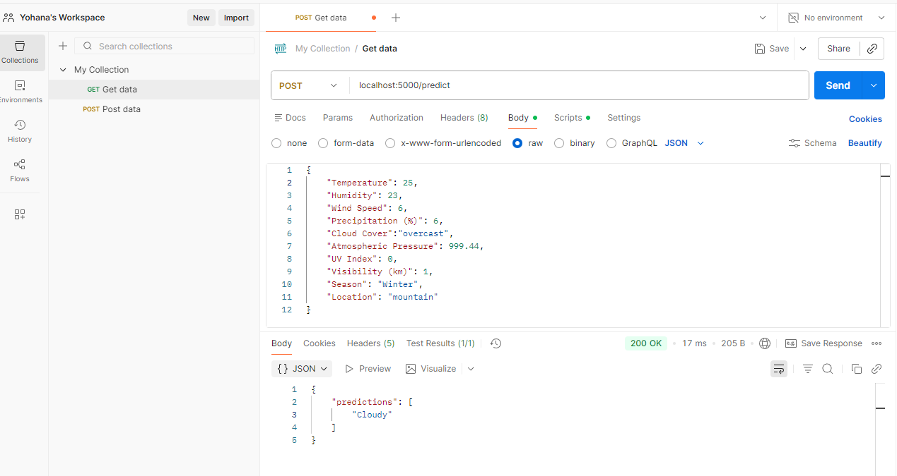

# weather_prediction_aplication

## Description

This project is a machine learning–powered Weather Prediction  application. It loads a trained model (weather_model.pkl) and provides predictions through a REST API endpoint. Users can send weather-related input , and the API responds with predicted weather conditions. This application demonstrates model deployment, API development, and real-time prediction handling. The application accepts the following features as input

1. Temperature
2. Humidity
3. Wind Speed
4. Precipitation (%)
5. Cloud Cover
6. Atmospheric Pressure
7. UV Index
8. Visibility (km)
9. Season
10. Location

## Installation

To deploy and use the project first clone it and use the deployment.

### Method 1: using a virtual environment

#### 1. Install a virtual environment

```bash

pip install virtualenv

```

#### 2. Create a virtual environment and activate it

```bash

venv\Scripts\activate

```

#### 3. Install the list of libraries in the requirement.txt

```bash

pip install -r requirements.txt

```

#### 4. run the predict.py file

```bash

python predict.py

```

And go to the link http://127.0.0.1:5000 from the resulting terminal


### method 2: Using Docker

First install docker in your machine and go to the deployment on your terminal and type the following commands

```bash

docker buil . -t weather_predict
docker run -p 5000:5000 weather_predict 

```
The above command will create and run an image for the project.


### Test the Application

We provide out inputs to the model using Postman and receive the output based on the features provided.

- Root endpoint: `GET /`

Should return: weather_prediction_application is running!"

- Prediction endpoint: `POST /predict`
Send JSON data, for example:
```json
{
  "temperature": 25,
  "humidity": 23,
  "wind_speed": 12,
  "precipitation":6,
  "Cloud cover":"Overcast",
  "Atmospheric pressure":999.44,
  "UV index":0,
  "Visibility":1,
  "Season":"Winter",
  "Location":"Mountain"
}

{
  "predictions": ["Cloudy"]
}

```
OUTPUT




